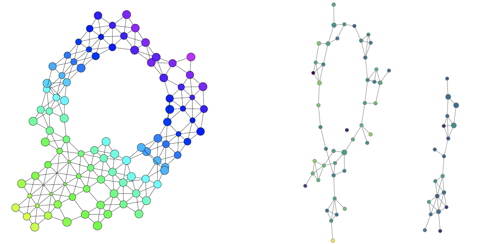

# Hi-C TDA analysis
 Brief review of the Hi-C Topological Data Analysis literature, with code reproduction.
 
 The review resumes the steps and TDA steps to analyze the Hi-C data.
 
 The code will be uploaded soon.
 
 ## Paper 
 The paper is a litterature review of the Hi-C experiment TDA, it does not follow traditional Hi-C analysis using HiCRep, or other libraries.
 
 ## Data
 The data is 1171 cells Hi-C interaction matrices, the average size of a matrix is (5324,5342).
 
 The cells are binned into 4 groups according to the cell 4 cycles (G0 , G1 , S and G2).
 
 The data is provided in an <a href="https://numpy.org/doc/stable/reference/generated/numpy.savez.html"> numpy npz </a> format.
 
 ## Code
The code is a reproduction of the paper results taken from the literature. The data being too large, the computation time is correspondingly high.
We take sample of data from each cycle of the cell and try to model it in a mapper. Although the shape of the mapper is not perfectly similar with the literature, we can already notice the similar pattern taking form.

 
<i>The first image is obtained in our code with limited sample data, the second image is taken from the <a href="https://arxiv.org/abs/1812.01360">Carriere-Rabadan paper: Topological Data Analysis of Single-cell Hi-C Contact Maps.</a>  Notice the formation of the circle pattern in both images.</i>

  

More details about the experiment and the code are provided in the pdf paper.
 
 
